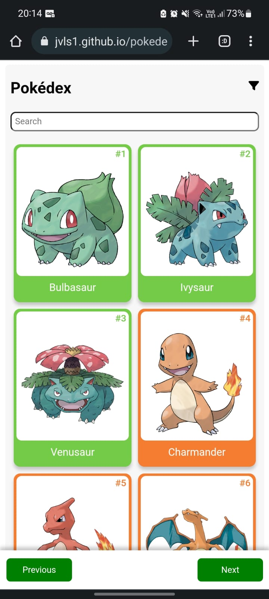
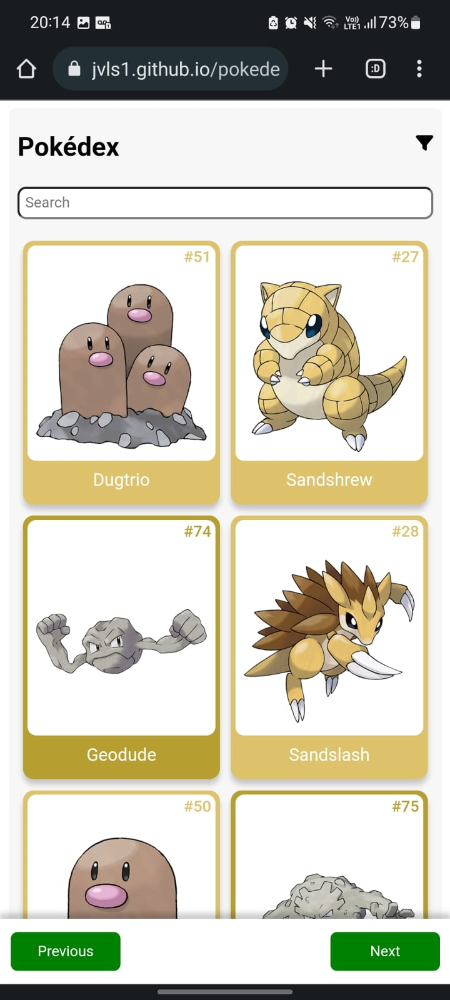
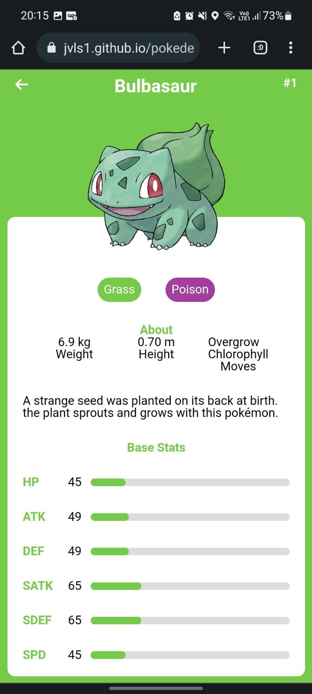

# Pokedex Vue

Its a project made to practice the Vue concepts and learn how to consume a public API 
to build dynamic web sites.

Still have some features to add, CSS bugs to fix and optimizations, but implement 
a search and pagination teach me some cool things about how they work on the 
client side, and implement a Figma design was great to practice CSS.

## Demo

jvls1.github.io/pokedex-vue/

## Stack

VueJS, VueRouter, JavaScript

## Screenshots

Initial Screen

Filter

Search

Selected Pokemon

## References

 - [Figma Design](https://www.figma.com/community/file/979132880663340794)
 - [Font Awesome](https://fontawesome.com)
